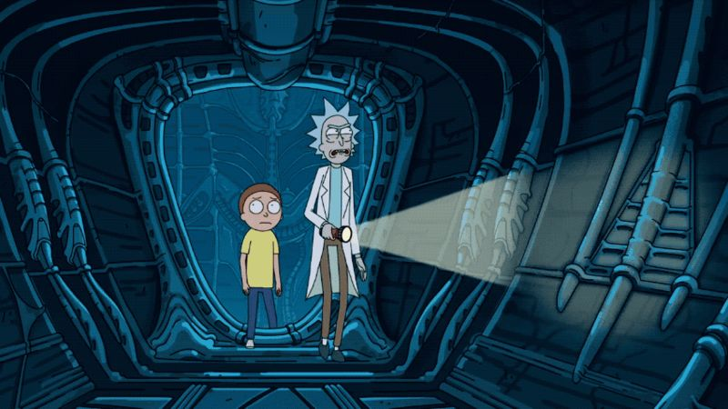
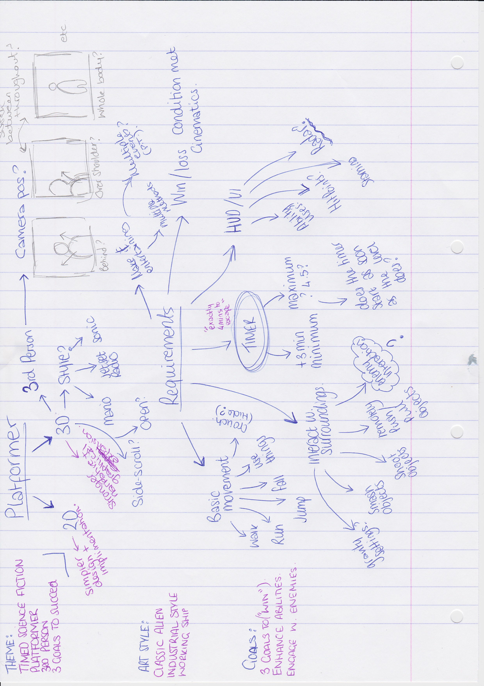
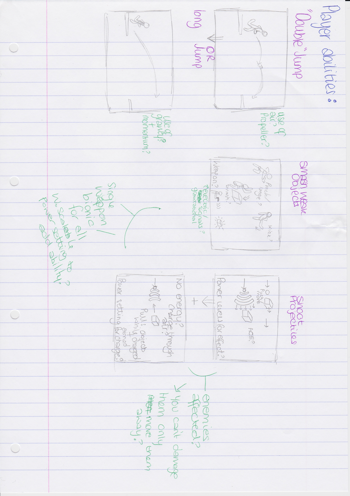
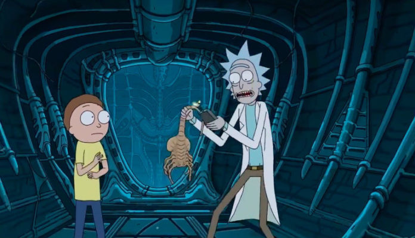

## The Brief..

Create a Science Fiction themed 3rd person platformer game with at least three minutes of gameplay.
Fulfill all the technical requirements shown in the Assessment Specification.
Use the unreal 3rd person blueprint project as your starting point.
Apply the design principles and techniques we are covering in the lectures.
Use free assets from online, but assume an artist will pass over it after you to make it extra beautiful.

The theme of this level is a crashing spaceship which is skimming the atmosphere of an alien planet on a steep descent, soon to break apart on atmospheric entry. You are a colonist woken from hypersleep and naturally you dont want to die.

The shipboard computer estimates the ships shields will fail in 3 minutes at which point the ship will begin to break up in a fiery death.

The level should have 3 goals. The first two goals should seem to the player to be valid escape strategies, but actually be unsucessful. Each goal should have at least one challenge to overcome before attempting it. The final goal should have 3 challenges to overcome and it will be successful as a way of avoiding death by fireball.

<figure>
        
</figure>

During the level, The player should:

Gain the ability to double/long jump.
Gain the ability to destroy some weaker obstacles.
Gain the ability to shoot projectiles which knock enemies/obstacles back.
Gain the ability to shoot projectiles which pull obstacles towards them similar to a gravity gun.
Overcome some kind of Enemy present within the ship.

> Better get going!... ~

## The Level

To begin with I made a few lists of the type of things that I needed to be aware of such as the theme, the requirements and the objectives. Making mock ups of puzzles and obsicles was then my next port of call. I toyed with the idea of using a player-item position swap using the gravity gun to pull
items within a particle defined space thus swapping the item and player. I also toyed with the idea of colour mixing puzzles in order to open doors but considering the time limit I decided this might be a little too complex or lengthy for the player to get through without starting to struggle. 

<figure>
        
</figure>

<figure>
        
</figure>

With all the requuirements in mind I started sketching out a basic level design in which to impliment a way for the player to find and use the ability sets and complete the levels end goal. 

<figure class="third">
	
	
	
	<figcaption>Just a few of the plans I had scribbled out...</figcaption>
</figure>

The player would initially start in a small uncomplex room allowing them to quickly become accustomed to the basic movement controles such as walking, jogging, jumping and crouching. Once this room is exited the player would encounter an enemy whom they could not destroy and will have to avoid in order to pass into the next room.
They will then come to an intersection where they will be able to attempt the first "fix" to their crashing ship problem. This will be waking the crew up. After attempting this at a terminal in this room the player will find there is no power to that specific unit. With this in mind the player will then need to venture to find that units power supply within this section of the ship.
When moving around this room they will also be able to obtain the gun however they would not be able to use it without the limited canisters they will later gain. By moving into the next room the player will be able to see the generator but not reach it due to the floor having caved in places. By following the room the player will be able to access another small room that will allow them to gain 3 double jump
canisters allowing them to get to and back from the generator which will bring the power back. 

Once returning to the terminal the player will find out they don't have a high enough clearance level to access the cryo chamber options and that the emergency systems are offline. 

The next course of action for the player is to bring the power for the emergency systems back online via a generator that the player had passed beforehand. This generator will cause the player to be thrown into a minigame that (unbeknown to them) they will not be able to win. This forces the player to then realise their best shot is to find the shield generator themself and find a way of turing it on.
In order to do this they will have to travers the larger room which is separated by a platform due to the floor again from having caved in.

From atop the platform the player can see the layout of the room below which due to the debris has bcecome mazelike. On this platform are canisters allowing the player to push objects away using the gun (with limitations) and pull objects with the gun (again with limitations). There will also be a security panel for the floor below showing an enemy that the player will be able to see from above, this pannel
will show the enemies patrol pattern around the rooms new layout. In order to access the room below the player will need to use the gun to pull something down from the room allowing them to safely travers down. 

Once down in this room the player will have to travers the maze like layout to reach a door which they will need a keycard for. This requires the player to find another exit in the maze leading to the keycard that due to the floor falling through they won't be able to reach and thus will need to use the pull gun again.
Once this is acheived the player can access the new room in which they will be confronted right away by another enemy that they will need to use the push gun to disperse. This allows the player to then access the shields generator and thus finally prevent the ship from crashing. 

Of course this is all subject to change but it's a good start.

> On we go!

<figure>
        
</figure>

## Put into practice

With all this said I've made a little progress starting on the building of the actual level and attempted to create the players movement using the third person tutorial level as reference.

<figure>
        
</figure>

>Gotta start somewhere...

