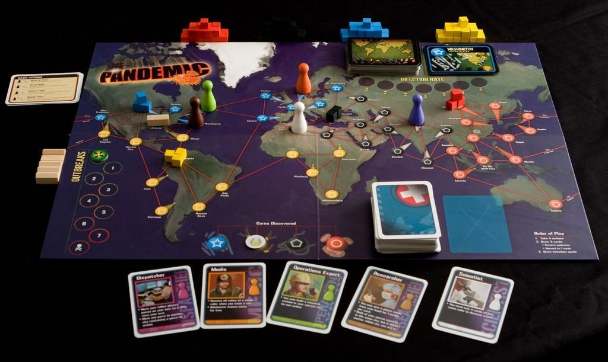
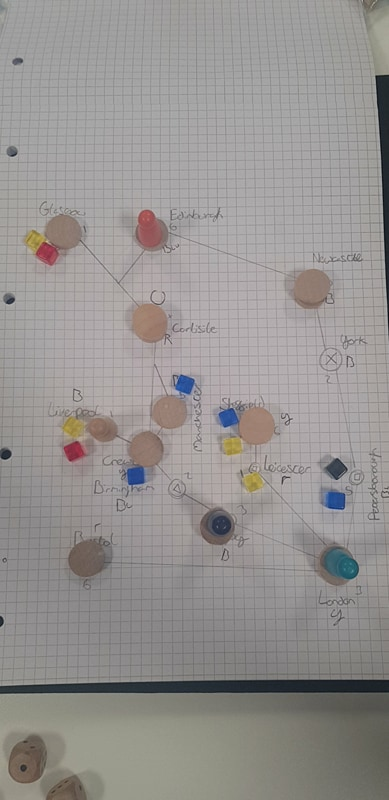
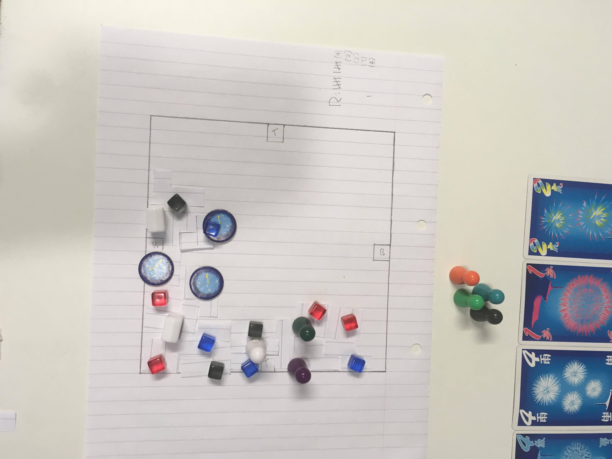
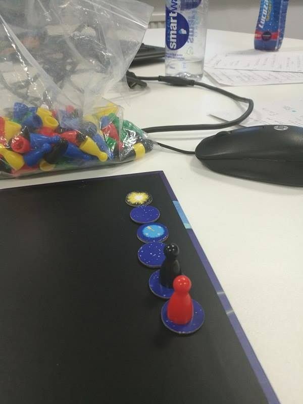
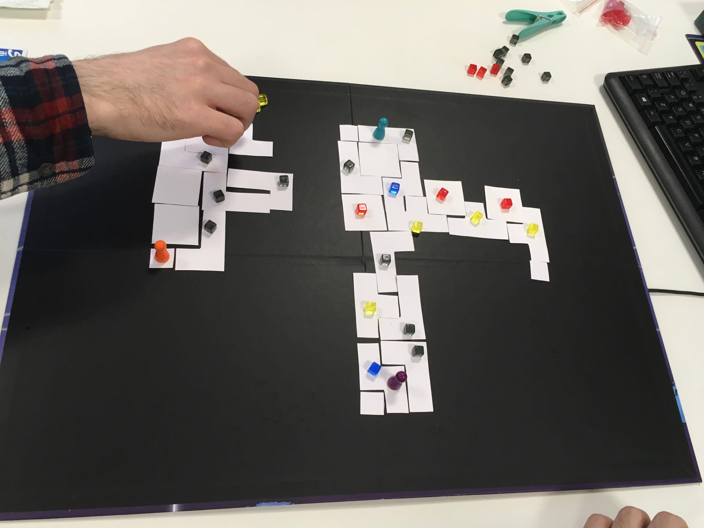
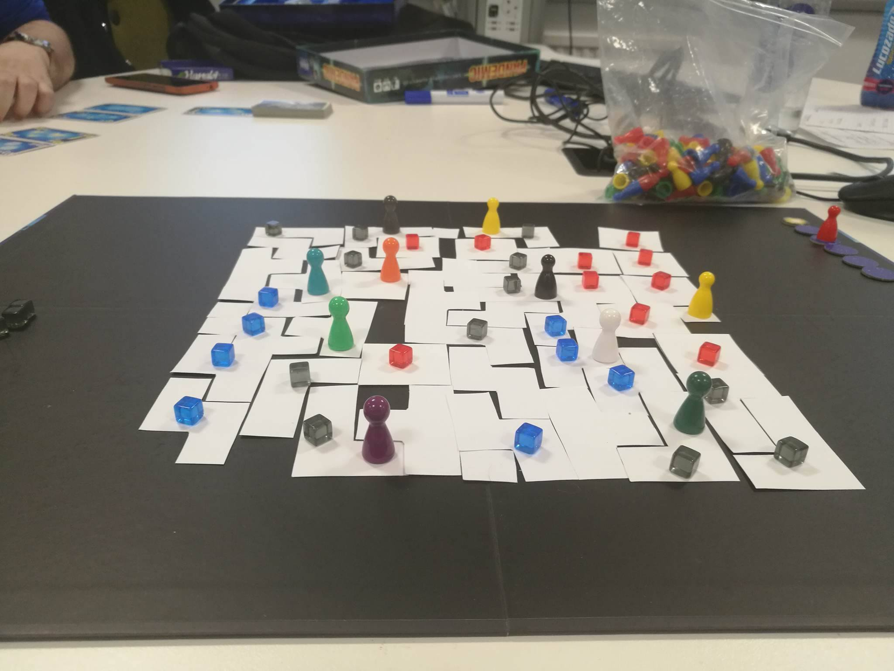

## The Original Ideas 14/11/17

Our task this time around is to create a boardgame of our very own. 
The theme needed only be a current social, political or economic subject. 

Some of the themes we explored to start with were schooling systems, inflation, the nuclear race, immigration and political rise. Many of which we wrote off almost instantly as being a little too close to the line of appropriate content, however 
after a lot of thought and research as a group we decided on the NHS and its ongoing staffing and funding issues, though we haven't solidly decided just in case we can't find a way to make it work or if a new subject matches an idea better.

<figure class="third">
	
	
	<figcaption>A few images of our experimenting stage...</figcaption>
</figure>

> And thus we begin ~

## The Beginning

To begin with none of us really had a starting point, we had a number of scrawled notes with potential styles and mechanics but nothing we could solidly put together. So as all good developers do when they run out of ideas we played some games and experiment.
From card games to dice games and then back to the classic boardgames (such as Settlers of Catan and Terra Nova) we figured trying more gave us more to work with and eventually we came across Pandemic.

Pandemic is a cooperative boardgame based around the premise of curing diseases before they wipe out the regions on the board. The overall goal of the game is to discover four cures before any of the game-losing conditions are met. Designed by Matt Leacock
Pandemic is one of the more uncommon types of boardgames due to its cooperative rather than competative gameplay making it a strange yet facinating article to study. With this being the case we all took an imidiate liking to the style and appearance of the game
and decided it was a great place to start.

<figure>
        
</figure>

Once we had a starting point we started to try and figure out what we wanted to include in the game, the mechanics, systems and dynamics around the subject area.

How did we want the game to play. Following Pandemics style the player could earn resources in order to acheive a goal such as expanding a hospital to accomidate a sickness. Cards could be randomly drawn to denote disasters which could affect the severity of such sickness.
Would players be able to trade resources amongst themselves and how would this benefit the gameplay. Could specific sicknesses be only cureable within specific spaces on the gameboard. Would the players manage more than one space.
 
In the end I think we came up with more questions than anything but in doing so decided on our starting point. 

<figure>
        
</figure>

> Something's developing...

## Serious Development 28/11/17

> A little late to update but here we go!

Over the last week a lot of the game has developed further away from the original Pandemic reflective origin.

At current we have....

# A playable game

I know. That was fast right? 

The gameboard consists of a grid. This grid is the hospital the players are required to build and maintain. Sounds simple enough right? Wrong.
There are a few things the player needs to take into consideration, those of which I will shortly explain. 

<figure>
        
</figure>

> Now bare with me here ~

## The Game Goes...

The aim of the game is to build and maintain a hospital between the players.

With 6 rounds and 5 turns per round the players must build wards using resource and funds cards in order to accomidate for a turn based income of patients with specific systems. 
A scoring system has be preposed allowing the players to finish the game before the 6th round by keeping note of how quickly each round is cleared. Thus the players are encouraged to complete the rounds before the 5 turns are
up in order to get ahead of a danger chasing them up. 

<figure>
        
</figure>

> For each round finished early players are "Safe" and their counter continues one space up the scoring (followed by the "end game" counter at the bottom which also moves up one space only two spaces behind the players initial 
starting place). Should players not finish a round or finish in the 5th turn their counter remains on the spot allowing the "end game" counter to catch up. This way players can finish the game before the final round if they 
successfully finish each round early.

Each round six cards are drawn from a deck of four colours. Each colour represents a sickness that must be cured but can only be done so in specific wards. For each card starting at the first round a single patient of that
sickness is taken into the "waiting room" for the hospital, it is the players job to clear all patients out of the waiting room before the round ends. For each round the cards values increase by one, this means that the first round
is supposed to be easy giving the players a chance to get accustomed to thinking about how the game plays. By the fifth round however each of the six cards will give the players five patients per card...They don't have long to start
thinking stratagy.

Each turn from a second deck of five colours and 5 numbers the players are delt three cards. White and blue cards are resource cards allowing players to build wards on the board from their specific starting cube. Red and yellow
cards are fund cards allowing the player to pay for the wards they build, hire doctors to clear extra rooms or fund research to give the players bonuses. Multicoloured cards can be either building or fund cards. 
In order to build within the hospital the player must have an equal or higher amount of funds in their hand in order to build but there is no limit as to how many buildings can be built per turn as long as you can afford them.

In order to give the players more options each player on their turn can trade with one other player. While this is the case the players can only have up to five cards in their hand at any time however they can choose which cards to discard.

Once a player can build using the required cards they can choose which ward they wish to build. The wards are represented by tetriminos and each of the four can take a specific sickness patient (for example the two by two block
can take in a single red patient). By using tetriminos the players have to think carefully about how they wish to place their buildings and without knowing which type of patients could be drawn for the next round players need to be
aware of which buildings are more apparent on the board in order to plan for the next rounds while still maintaining the current demands. At the end of the round all patients in wards are cleared, this allows players to instantly
take in patients they have space for at the start of the next round. 

The players then continue through the rounds to build and take in patiends from the waiting room until either the round is over or all patients are clear. 

<figure>
        
</figure>

Players can also by using fund cards amounting to five purchase doctors. Doctors once bought are placed on the purchasing players starting block and can not be moved on the first turn they are bought. However after this turn
they can move one block per turn and remain on that square to clear a patient from that room by the end of the turn rather than the round. This makes them undescribably valuable as the game begins to progress.

While we have research involved we haven't yet given the cards a value though each card in the new smaller research deck will count very similar to the development cards displayed in Settlers Of Catan giving the players a small or large boost
at a random chance, this way a single card alongside the players strategic thinking in ward placement and doctor movement can be the difference between the game one and lost.

> A lot to think about right ~ 

While there is a lot there and it seems rather confusing after the first turn it's relatively simple to pick up the flow of the game. Starting off easy also gives the players time to experiment before they realise that the game
isn't as simple as it appears.

By separating the game up we planned to give the game a reltaively equal amount of skill and luck. 
The luck is represented by the card draws and randomised patient intake while the player skill is shown by trading building, doctor movement and observation of the board game itself. 
For example a player could draw a hand entirely full of funds however by carefully trading they can allow other players to build. By observing the gameboard players can recognise when they think they could have a problem should a 
specific type of sickness be drawn. For example if players are lacking black wards should a full six hand of black cards be drawn on the third turn the players would have almost no way to clear all the patients. This is also
where we want to make research more prominent. Should a full six cards of one colour be drawn on the fifth round it would be impossible for the players to clear them all in five turns thus research cards and doctors become the 
defining factor.

<figure>
        
</figure>

> With most of the mechanics down all we need to do now is balance it out a bit... ~

## Iteration and Play testing

In terms of the iteration as a group we player a lot of games... > A LOT
of games.... and after a few tries it was clear to see what worked and what didn't. Pulling from external games only worked so far before we started to find balancing issues. However once one idea was started the development went on.

Originally we had started with a domino style game that ran through numbers, very quickly we found this to be ineffective due to shear boredom and too many numbers becoming hard to keep track of. Thus we started exploring more methods.

The origin of the game we have no comes from Pandemic clearly from the sketches and inital thoughs however looking at Pandemic to what we have now there are quite a few dramatic differences. All of these came from the iterative process
we went through adding, subtracting and editing the game mechanics and appearances. The most obvious of these is clearly the game board itself.

Starting off as a simple circles and lines board the game after a number of issues arose while playtesting became what it is now.
While the iterative process was key to the creation of the game so was the play testing we did with outsiders. After a number of people had played our game the same key feedback started popping up, such feedback included the following:

The game needed a set board - Due to the way players would build on the board the dimentions would make forward planning very difficult. To combat this was a simple fix including creating a set gameboard to play on with starting places 
for each player. 

Rounds ended too quickly - Because of the way in which the rounds and turns for the game were set up it ended up being more benefitial for players to not finish rounds early due to the preperation time they would lose by doing so. In order
to eliminate this we decided to give a set number of turns per round to stop players from having this issue.

The game tended to start off too easy and spiked in difficulty - Because of the gradually growing turn intake the players found that early rounds were too easy to deal with but reaching round five and six players found it was near impossible to 
complete levels at all. To combat this we created a balanced single large intake at the start of the round and removed the initial growing turn based intake system evening the way players would distribute the patients.

Lack of doctor usage - A lot of players found little to no use for the doctor system. This was a massive problem within our game as the doctors were intended to become very important during the later rounds but players just weren't using them.
To make them more useful we increased the amount of movement and involvment doctors have within the game making them benefitial early and late game.
While we initially had types of doctors we very quickly found that through the play tests these weren't benifiting the players in any way and in the end just removed them.

Research wasn't work the risk - The research tree we had initially implimented wasn't being used due to the low reward to risk ratio, it took too long for players to get to the more useful buffs so they didn't want to invest. Our quick fix for this
was to include a new randomised deck of cards much like the development cards from Settlers Of Catan in order to make it possible for players to luck out and get better buffs early evening out the rewards system.

## Finaly at this point we also gave the game a name...

# Tetropital

> See what we did there? ~
