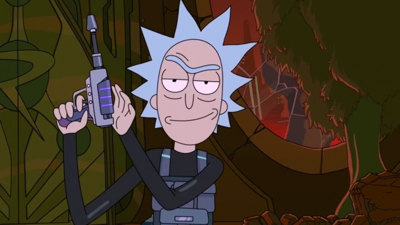

## The level

So, It's been a while....In the end I focused on other coursework and with a huge number of unfortunate events between I've not had much time to actually get work done but hell.
Now I'm back and ready to go I thought I'd detail todays advances in terms of the level I've been designing.

And BOY have we made some headway on this one. Today has probably been the most progressive day I've had in a long while, so lets get down to the details.

<figure>
        
</figure>

> Buckle Up Boys and Girls... ~

## Animations

<figure>
        
</figure>

Well damn. That's a big difference from the way the level looked last time.

So over the last six/seven hours I've done a lot of things. 
To start with I rebuilt the entire level and removed the up and down levels aspects of the level because having lost a lot of time It's easier to work around it and simply add more mechanics to allow players to access the
rooms differently. Flashing lights have also been implimented to try and make it more apparent that the ship itself is malfunctioning.

Adding in doors I've made use of trigger box's and matanee's to create smooth opening animations complete with lighting and sound effects. While I was at it I stuffed some props into the rooms to make them seem more 
full. The rectangles you see in the first two rooms are representative for chryo chabers in which passangers on this ship would be sleeping. However in this case none of them will wake up. 

Continuing on, in the second room I decided to add some flair giving the player a good look at the enemy AI I'll be detailing later on by using a malfunctioning door again created using the same methods. This door is blocked off by a glass
pane to prevent players from moving through and accessing the outside of the map however. 

Continuing on, I've replaced what would have been the ladder area with an unreachable vent. In order to access this the player will need to make use of the gun they will gain in the next room. In this room however the player 
will be able to gain the ability to double jump allowing them to complete the next room. 

Nothing as of yet is in this "next room" which eventually will be the generator room which during the events causing the player to wake will be full of electricity making it deadly to continue. Thus the player will take
to the true platformer style of the classing jumping puzzle in order to access the still functioning generator at the other end of the room. 

Complete with a number on non-accessable doors the level has gained a lot more in the short time than I anticipated. However the part I'm most proud of completing is the animations.

As you can see above, though the player has no weapon at current they can use shift to enter the running animation, control to enter a crouching animation (Used to get through the vent) and right click in order to equip
a weapon and access the run, walk and idle animations for having a weapon. All of these have been created using custom blend spaces and by editing the animation blueprints and character blueprints for the third person
template. All I can say was that it was not as easy as I thought it would be but with a little help from youtube I figured out where I was going wrong. Of course as always where coding is concerened it's often as simple as
a tick box...

> But wait....

## Well of course you're not alone

<figure>
        
</figure>

Oh yes..

I went as far as to add in enemies. 

Using a mesh and selection of animations (the likes of which I'll detail in the project page once I've got the time to update it) I've added an enemy to the level, complete with AI.

In the second room the player will be made aware of this through the malfunctioning door. Just to keep them on edge... However they will not encounter an enemy until the final room. This is where I've made the least
progress, the room itself is there but its very linear and has no props or functioning lighting implimented yet. However for the sake of demonstration I created a way for the player to access the vent into the room
to demonstrate the enemy AI.

As shown above the enemy will not notice the player if he or she is out of its view however once spotted it will delay, running animations before charging for the player. This enemy is designed to follow until it looses 
sight of the player. This enemy is also scripted to roam around the area in a random manner. This is to give the player a new experience every time they play, no matter how many times you go into the room you can't judge which way the enemy will 
move until it does so. I'm hoping this will give the level a bit more of a horror game feeling setting the player on edge and requiring them to watch carefully.

The enemy also has its own blend spaces and blueprints for animation and movement. This includes the basic movement, idles and also alternating attack animations.

If I do say so myself I recon that's pretty good for just one day and now I know how to do it, everything will be twice as fast next time!

> Go me! Feeling a bit more like I've got a hold on things now~

