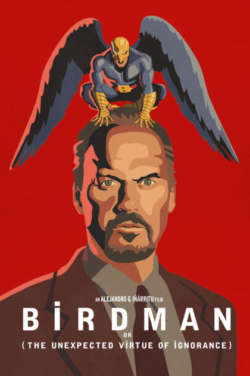
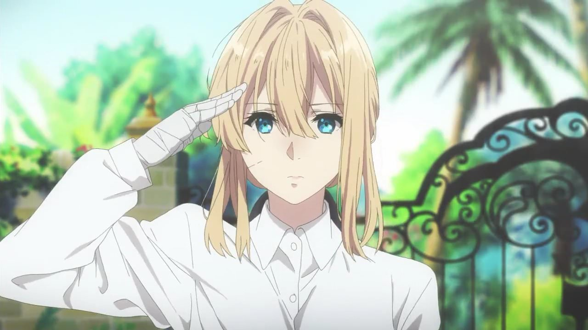
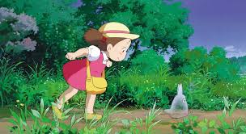

## Birdman who? 

Birdman, the 2014 Drama about a washed up cinema hero Riggan Thompson, played by Michael Keaton, as he tries to mount an ambitious broadway play in the hopes of reinventing his career.
Personally, I didn't like the film itself. However there is not one person who can deny the depth in which the film explores the internal struggles faced throughout its progression.

Riggans journey is displayed in depth and with such tremendous dark undertones it's hard not to take note and sympathise with some of the things he goes through. 

How to turn this into a game however..Is exactly what this assignment is asking us to do.

<figure>
        
</figure>

>  ~ A task that we found much easier in planning. 

## Sentire

<figure>
        
</figure>

Sentire - The name of the game we proposed. Latin for Feel, or to feel. 

As you can guess our game is based on Riggans internal struggle. The way he battles with his emotions and the way external factors show such resilience in creating turmoil in his life.

As such we proposed a 2D - beat 'em up/Fighting game. Our intention is a more adjusted approach to streets of range with an undertale pixel art style with a dark undertone.

From the get-go we knew this kind of project would focus very heavily on the use of audio. Music and audio cues would essentially set the games emotions in place for the player.

## The Mechanics and Composition

The game will open into a Cuphead style map showing the player which levels are available to them right from when they open the game. As the player completes levels more will be unlocked on this 
main map. 

Each level will be composed of a different theme causing enemies and playstyle potentially to change and we intent to have all levels open to play at any time, in any order as they are unlocked in order to 
give players the notion that they are exploring the internalised struggles of an indevidual. 

Over the course of the levels (and within some levels themselves potentially) enemies will increase in strength giving the game an increasing difficulty.

A side notion we had toyed with was to show the levels themselves to change as they progress. For example a level about death would start happy and bright, simple and with relative ease however 
once the player starts getting further and further through the themes darken, the enemies are harder to contest and the general atmosphere becomes almost unsettling.

Of course a final level will contain a boss character who can only be unlocked through all other levels being completed. We again toyed with the idea that the final boss could be birdman himself or in a more
elusid term the player character. This would give a lot more depth to the levels played in terms of progression while creating a more intricate progression.

Score boards through levels and additional levels could be added to give the game replayability and as the game progresses it would be interesting to give players a number of abilities to gain and see how they use them
against different enemies.

<figure>
        
</figure>

