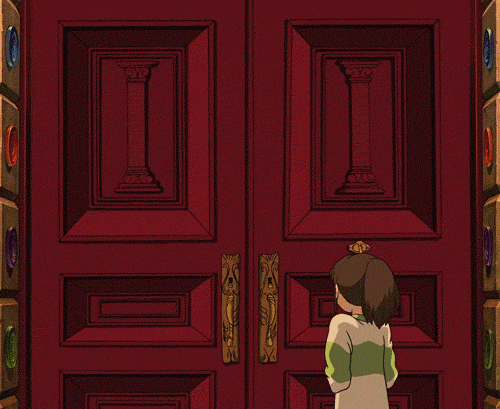
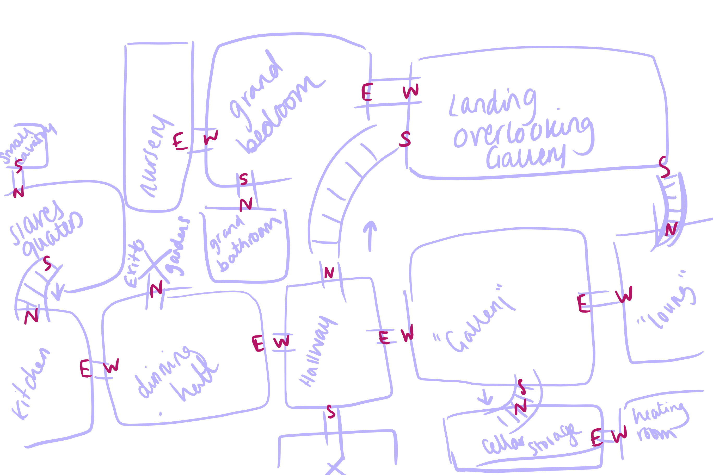
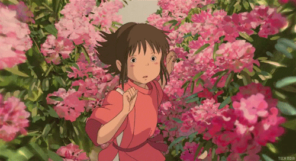
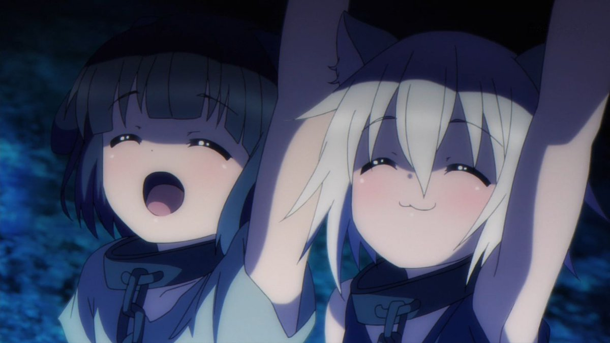

## The Dungeon

Back to the dungon, only so far...There is no dungon. We have all the setup for the basic characters and enemies however they had no dungeon to actually reside in.
So that's what I did next. New class files for dungeon and room were added, using a struct to create a "roomlink" allowing a vector of rooms to hold variables like a rooms description and names.
Each room holds variables for each direction, north, east, south and west within the room link allowing me to link them together within the dungoeon files. 

<figure>
        
</figure>

Within the dungeon files each room within the room vector is given its variables. - It's name, description, and the description for all of its room directions.
The imgage below shows the basic layout of my dungeon, an example of the descriptions for direction could stand as "room.north.description = Through the darkness you can barely spot an opening to the north of you".

<figure>
        
</figure>

>  ~An evil mansion? Or is there more to it?...

## So?....How do I move rooms?

<figure>
        
</figure>

It's all good and well having a dungeon but if you can't move you can't see it in all its glory. A such going back to the basic game actions I've added 'move' directions to allow us to create game actions linking through to the room links.
To make sure all this worked the player and bat also got their own descriptions.

<figure>
        
</figure>

In the main files I then added in links to each room through the new game actions this now allows the player to move between rooms while displaying the rooms information.
All actions in game are executed using string literals. This means you only need type the word to execute an action, for example as shown below you would type east to move east or south to move south and press enter.
Of course this can cause issues with capitals and errors while typing but to make it easier all input is automatically capitalised and an error / unknown stringis given if an input is unknown.

<figure>
        
</figure>

## Can I pick things up? 

Next port of call was to star setting up a basic inventory. In order for our hero to pick up items she or he needs somewhere to store them.
In order to make this a possibility I've added an item class file which will be abstract letting me add items to a vecotor that is inventory.
To add into this I created a key class to add to the players inventory and added PrintInventory to allow the player to type Inventory to show what they're currently carrying.

## Badass dungeons need badass music

To add to the atmosphere of the dungeon itself I've added the Irrklang directories to allow me to add audio.
With relative ease these directories allowed me to add death sounds, attack sounds and looping background music.

## Menues? 

Finally In order to allow the player to access the game and eventually instructions and settings I needed a menu. For now this is just some text on screen, however it's the method that allows for more mediation.
Introducing Game states allows more control between menu and gameplay. Adding an enum class to the main game file to hold the game states allows me to mediate what happens in which state.
For example, pressing escape while in the play state will take the player back to the menu, while pressing escape within the menu will exit the game and enter within the menu will return the player to play.
This neatens up code and allows me to separate the states into their own sections of code with little crossover.

<figure>
        
</figure>

> ~A lot of updates but we still have a long way to go. 
> ~Next on the menu? Lets get some more enemies and get them spawning into the dungeon.

## Onwards fellow adventurers! 
