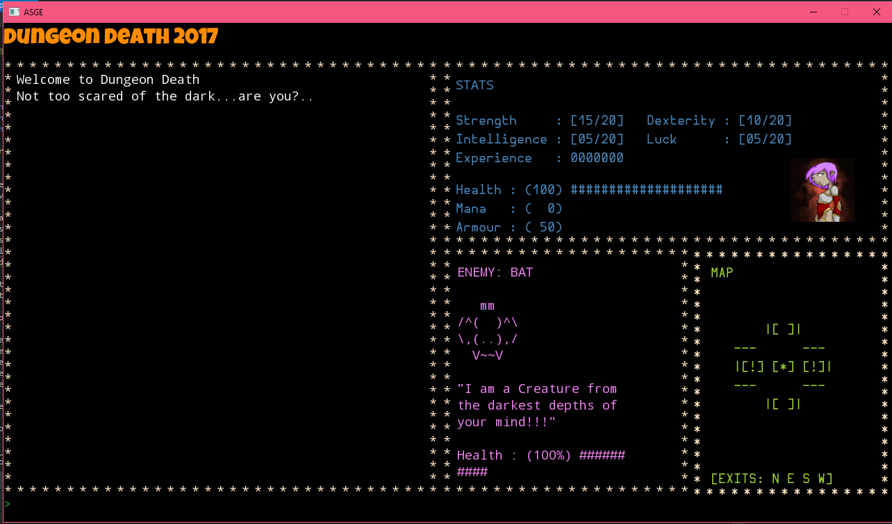

## The Task At Hand

As this terms progressed we've been given an assignment to follow a number of tutorials for "Dungeon Death". A dungeon crawler style game within the console using the ASGE engine.
Having started a while back I've struggled getting to grips with the manner in which the engine runes but already its clear that the goal is Object Oriented Programming.

<figure>
        
</figure>

>  ~I'm interested..

## The Basics

<figure>
        
</figure>

So as you can see the above image is the basic given code base's output with a few personal changes. 

The Intro text and feedback box on the left will give the player all information in terms of how the game is playing and responces to their interactions.
To the right we have three boxes handily coming with lables. The Stats panel giving the player updated information about their player character, the Enemy panel showing the current enemy being encountered and the map 
panel showing the dungeon map.

All of which will be customised and updated per frame so the game itself runs smoothly.

<figure>
        
</figure>

## How? Or How? 

From the original code we were given we've made some changes in order to push the game further to being object oriented. 

Originally the Player Character resided in its own instanciation while the bat was simply a string printed to the screen. Now the player and bat both belong to a character class allowing them to share variables (attributes) such as health and armour.
This then allows the specifics of the variables to be defined and set withint the files specific to the player, bat or any new character that would be added at a later date.
The players health and mana are shown on screen as a dynamic string that when attack and defence is implimented will allow the player to see the bars alter as the player is hit or uses spells etc.

While it's still primitive, the assignment should advance with relative ease thanks to the changes made so far.

<figure>
        
</figure>

