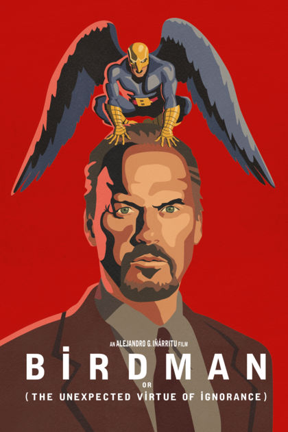

## The Synopsis

Birdman is 2014 movie directed by Alenjandro Gonzalez Inarritu about actor Riggan Thompson (Played by Michael Keaton) who is plagued by his previous roll as cinema superhero Birdman as he's building on his own broadway production.
As many problems arise Riggan is often displayed as being confronted by his own Birdman persona as he struggles to deal with his girlfriend, daughter, ex-wife and his play.

The task at hand was to create a game based upon this film. 

<figure>
        
</figure>

## Sentire - To Feel

A 2D beat 'em up game based on Riggans internal struggle, the way he deals with his emotions and others around him through the period of the film. 

The game was to feature a cuphead style menu with open levels that would become accessable once  the previous one was complete. The levels themselves would feature and infinate runner feel while pitching players against a number of enemies that while specific to level would represent 
some of the internal struggles Riggan faces through the film. 
The final level was to contain the player themselves as a boss mob to give the game even more depth again. 

Within the time constraints in the end there was very little to this game but a lot more under the hood.

The final game looked something a little like this: 

<figure>
        
</figure>

Due to the time constraints and our overambitios expectations, the game ended up being more of a game engine than a game. The set up for some pretty amazing features was there however we very quickly ran out of time to impliment them.
While the game ended up looking rather lost it made good practice for judging time and understanding work load and flow. 

The codebase looks a little more like this:

<figure>
        
</figure>

<figure>
        
</figure>

