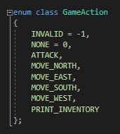
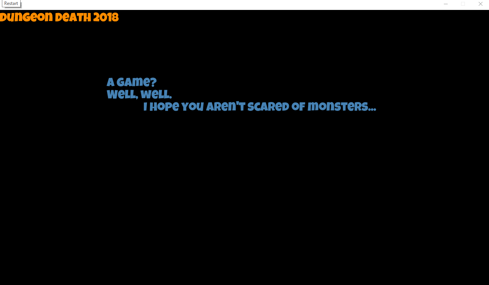

## The Synopsis

Dungeon death is an ongowing project over the last year to create a text based dungeon crawler. 

<figure>
        
</figure>

## Dungeon Death

The text based game makes use of C++ and ASGE to create classes and basic functions in order to create a basic yet dynamic code base.
The game itself can be accessed simply through the debug menu (as it was not intended as anything more than practice and assignment).

Once opened Enter and Escape can be used to move between the menu and gameplay, while on the menu Escape will simply exit the game however.
Help will display all other commands, i.e. 
Inventory - Displays inventory.
North, South, East, West - Move into the room in the respective direction.
Attack - Attacks the current enemy.

<figure>
        
</figure>

Once the game is being played the viewport will alter to allow more text to fill the screen. The current game appears as such:

<figure>
        
</figure>

While this is the case there are a number of bugs I never quite got to fixing.
The random generation for enemies causes a crash when the player moves into a room with a new enemy, I would assume this is caused
by wrong format within the Json file being used to create the enemies. 
The player will crash if trying to attack with no enemy present, a simple bug I put aside for the sake of finishing a little more.
There is also currently no way to finish the game.

You just endlessly move between rooms...forever...
