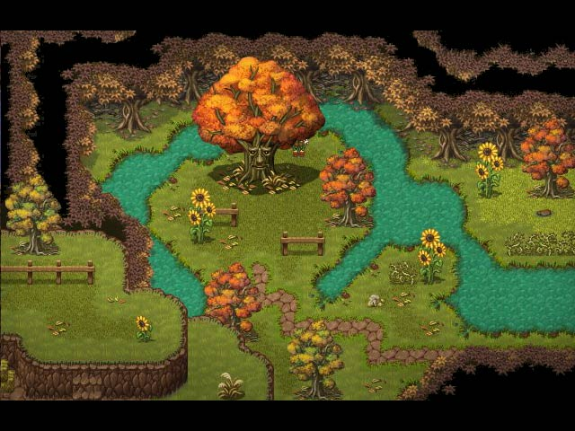

## The Synopsis

Deadlock is a networking based game derived from an Xcom style turn based multiplayer design. 
Based on an apocalyptic setting the players need to save as many civilians as possible and loot and plunder their way through rounds of incoming zombies.

<figure>
        
</figure>

## Deadlock

At current the basis for the game is there, a menu in place and game grid created. We moved along with a RPG Pixel style to make the game simpler to look at and design
while still keeping the darker tones of the game itself. Much like some of the Aveyond games.

<figure>
        
</figure>

Once there's a little more to show this page will be updated~
