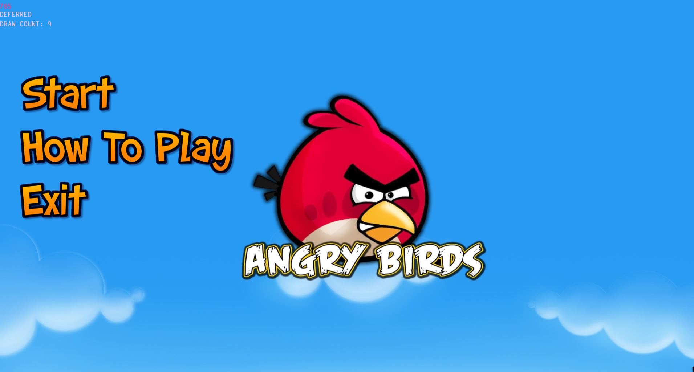

## The brief

For this assignment we're being asked to recreate angry birds for a pc setting. The game needs to have a menu screen, tutorial and the obvious gameplay. In order to create this we've been given the ASGE engine to work with along side some very basic base
classes.

<figure>
        
</figure>

To begin with I started laying out the basic classes for the animals (birds) - the item being thrown. This didn't need to be used yet but having the basic there gave me a lot more to build on for later when I was working on the gameplay.
Once I'd set up the groundwork I started working on getting the mouse clicks and movement working and just to add some flair I assigned the mouse a sprite and hid the original cursor to allow the mouse to fit into the theme a little more. 
Getting the clicks and mouse movement working was a little bit of a hassle, I had to use two seperate callbacks, one for mouse clicks and another for recognising if the mouse had moved. This made doing mouse checks a little more complex so for the moment
I only have the start button on the menu screen set up.

Realising that it would be easier I set up two enum's within the base game file. One for the level being loaded in and another for the gamemode, i.e. if the game was in a play state, the menu, the tutorial or exiting the game. This made transitioning 
between the menu and gameplay much smoother. I then set up the escape key to take the player back to the menu when in game later to allow for a "Pause" functionality. At current the enum for levels is set up but not yet active, i've simply set the level
to one for the moment to make testing gameplay much easier.

Now that the start button on click moves to the gameplay state I wanted to start working on the game itself. Later I hope to be able to go back and spruce the menu up a little more by giving visuals when buttons are moused over and possibly some background
music. 

Moving onto gameplay I needed to render in the animals(birds), in order to do this I set up new files for the animals derived from a game objects class that holds data such as sprite components. This allows me to add and load sprite components at any point.
While the class files are set up I've run into an issue with the rendering of the sprites. The animals are broken down with another enum allowing me to later specify which animal types to what and what they look like aswell as which levels they are accessable in.
However because this is in a seperate class and not the main game file I seem to be unable to access the unique pointer for the renderer that allows me to assign the sprite component loading in the sprite. After rolling through a number of includes and trying
to reference and redefine the renderer pointer I've yet to be able to get it working. Thankfully I did spend some time making sure the code does work if put into the main file as a last resort if needed. 
Hopefully I'll figure that one out soon as all the bricks and the aliens(birds to aim at) will need to be loaded in through the same manner allowing me to then draw a bounding box from the sprites using the sprite components.

For now however I'm just glad my menu looks rather delightful with its fancy mouse pointer.

<figure>
        
</figure>

>  ~Explosions to be decided...

