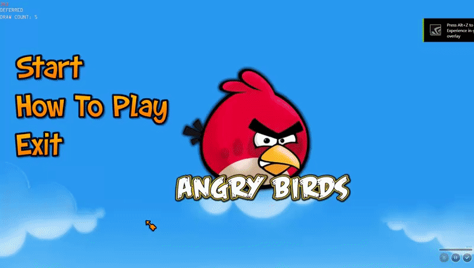
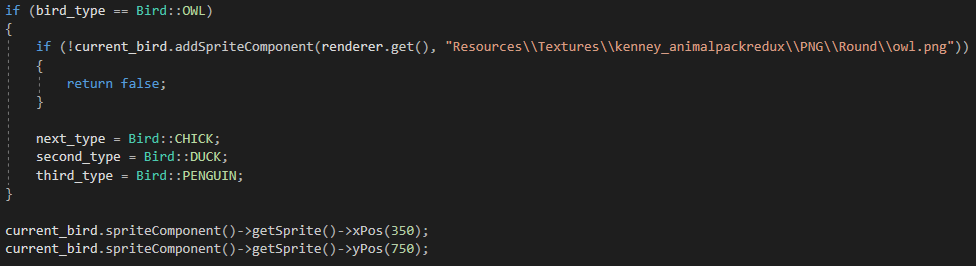
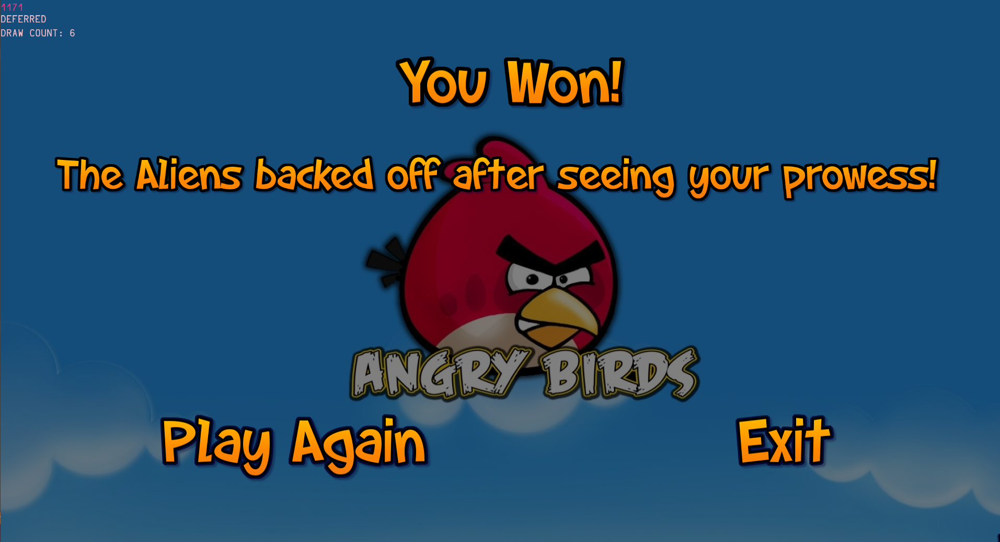

## Updates

So in the end I couldn't get the birds to render through using object orientated programming. Yikes, I know. For now though I've set everything up so that when I have it working all I need to do is change the instance in the main files
from GameObject current_animal to Animal current_animal. I've set up and renderer everything in the main file the same way I was attempting in the new files so that when I make the change I'll have less to move around. I'm not one for stewing over 
a problem so instead of running up all my time trying to get that working I've moved on to getting as much else working as I could.

<figure>
        
</figure>

~ A lot has gone on. 

To start with I went through and created an system for saving and storing the waiting birds. This way you have a sequence of birds visible on screen that will change as you throw them, letting you know which bird type is next in line.
This system closely resembles my Game States used to move between the play, menu and other states. It simply states that if the bird type is a specific type the next bird is another specific type and so on. Once this is updated the next 
bird is stored as the current bird so that once the current bird is released the next bird will take its place.

<figure>
        
</figure>

I then started working on a win screen and game over screen, both of which are pretty much the same. The only difference is the win screen shows win text while the game over screen only offers exit or play again options.

<figure>
        
</figure>

The birds now can be thrown however the arch they should follow is a little....broken at the moment. I managed to get it working but the bird was moving WAAAAAAAY too fast, and while trying to even the speed out the bird stopped following the curve 
all together. However at least it moves at all I suppose. 

I've also moved some of the enums for gamestates and the eventual level settings into their own files to save space and tidy the code.
Still I guess it does work...kinda..

>  ~To the moon...

